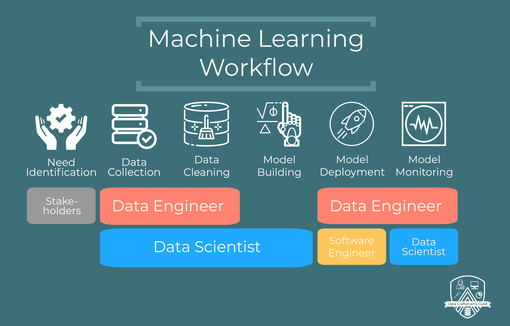
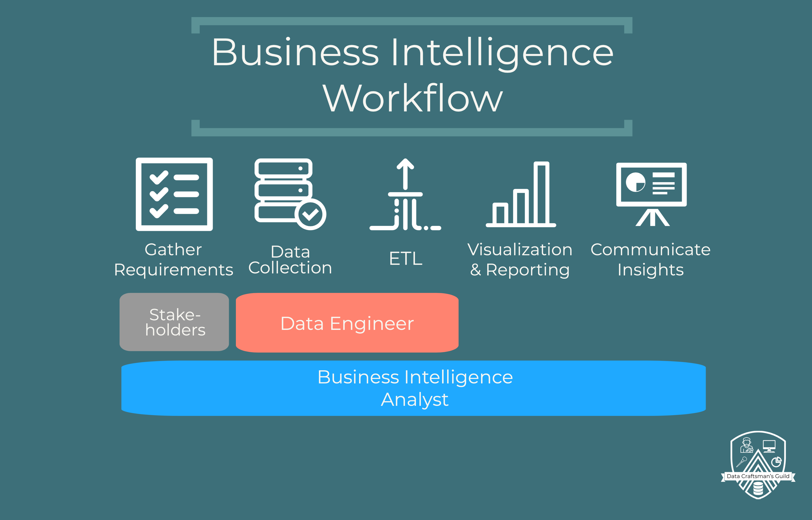

# Python-For-Data-Engineers

This repo contains all of the code used in the free Data Craftsman's Guild tutorials on Python for Data Engineers. 

## [Start Playlist](https://youtube.com/playlist?list=PLw_6QGGsDtSurllpQMTbB37H9vPb-MZDb)

## Videos:
* [Import CSV Files into Python](https://youtu.be/8eIFUm1c6uM)
* [Import JSON Files into Python](https://youtu.be/QgkWe_g7Hnw)
* [Basic Web Scraping in Python](https://youtu.be/twyNogkjBjU)
* [Machine Learning Workflow](https://youtu.be/-Ke0dyCUJE0)
* [Manipulating Data in Python (Part 1)](https://youtu.be/4fLkmmvV2Xs)
* [Manipulating Data in Python (Part 2)](https://youtu.be/ZndCTP-U7gU)

## Coming Soon!
* Manipulating Data in Python (Part 3)

## Additional Resources

### What does a Data Engineer Do?

